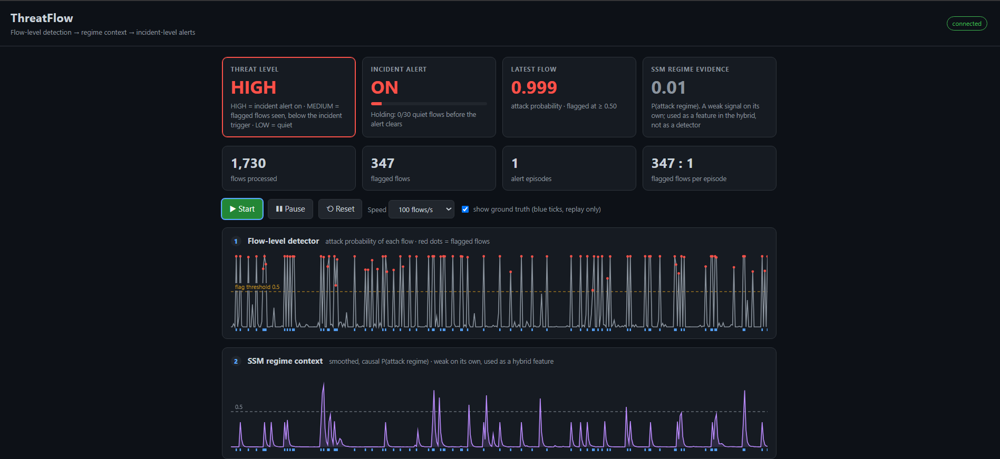
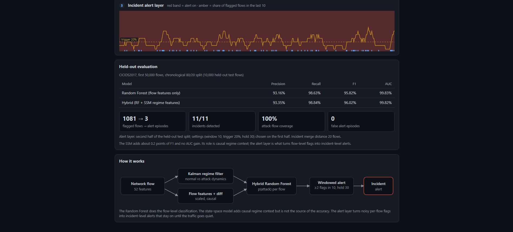

# ThreatFlow

### Streaming Cyber-Threat Detection → Incident-Level Alerting

ThreatFlow is a streaming cybersecurity prototype that turns **noisy flow-level network detections into a small number of persistent, incident-level alerts**.

A Random Forest detects suspicious network flows. A Switching State-Space Model (SSM) provides probabilistic temporal regime context. A streaming alert state machine then aggregates sustained evidence and promotes it into incident-level alerts.

> **The key idea:** don't alert on every suspicious flow. Detect when suspicious activity becomes persistent enough to matter.

---

## 🚨 The Problem

Modern network intrusion detectors can produce large numbers of individual flow-level predictions.

That creates a practical monitoring problem:

```text
Is this flow malicious?
        ↓
        ↓
Are these suspicious flows part of the
same sustained behavioral change?
        ↓
        ↓
Should an analyst investigate this as an incident?
```

ThreatFlow focuses on the second and third questions.

Instead of treating every prediction independently, it processes traffic chronologically, maintains temporal context, and applies persistence-based alerting.

---

## ⚙️ How ThreatFlow Works

```text
             CICIDS2017 Traffic
                    │
                    ▼
          Chronological Processing
                    │
                    ▼
          Random Forest Detector
                    │
             Flow-level flags
                    │
          ┌─────────┴─────────┐
          │                   │
          ▼                   ▼
     Suspicious flows   Switching SSM
                              │
                              ▼
                    Regime probabilities
                              │
                              ▼
                    Temporal context
                              │
          ┌───────────────────┘
          ▼
    Streaming Alert State
       Machine
          │
          ▼
   Persistence / Hysteresis
          │
          ▼
   Incident-level Alerts
          │
          ▼
      FastAPI Backend
          │
          ▼
      Web Dashboard
```

### The three main components

#### 1. Flow-level detection

A **Random Forest** operates on network-flow features and produces suspicious/malicious flow predictions.

On the held-out evaluation set:

| Model             | Precision | Recall |    F1 |    AUC |
| ----------------- | --------: | -----: | ----: | -----: |
| Random Forest     |     93.16 |  98.63 | 95.82 | 99.827 |
| RF + SSM features |     93.35 |  98.84 | 96.02 | 99.823 |

The hybrid configuration improves F1 by approximately **0.20 percentage points**, while AUC remains effectively unchanged.

Therefore, ThreatFlow does **not** claim that the SSM materially improves the underlying classifier.

#### 2. Temporal regime context

The Switching State-Space Model provides probabilistic information about the current traffic regime.

It helps characterize:

* Current behavioral regime
* Regime probability
* Temporal transitions
* Persistence of changing network behavior

The SSM is therefore used as **temporal context**, not presented as a replacement for the flow-level detector.

#### 3. Incident-level alerting

The streaming alert layer is the main operational component.

Instead of creating an alert for every suspicious flow, ThreatFlow maintains streaming state and requires sustained evidence before promoting activity to an incident.

Current configuration:

| Parameter         |                        Value |
| ----------------- | ---------------------------: |
| Window            |                     10 flows |
| Trigger threshold |                          20% |
| Hold              |                           30 |
| Tuning            | First half of held-out split |
| Final evaluation  |                  Second half |

---

# 📊 Results

The streaming evaluation produced:

| Metric             |      Result |
| ------------------ | ----------: |
| Incidents detected | **11 / 11** |
| Incident coverage  |    **100%** |
| Alert episodes     |       **3** |
| False episodes     |       **0** |
| Flagged flows      |   **1,081** |

The operational transformation is:

```text
1,081 flow-level flags
          │
          ▼
   Temporal aggregation
          │
          ▼
     3 alert episodes
          │
          ▼
  11 / 11 incidents covered
```

This is the central result of ThreatFlow.

The prototype is not primarily claiming a major improvement in classification accuracy. Instead, it demonstrates how a stream of individual detections can be converted into a smaller set of **persistent, interpretable security alerts**.

---

# 🖥️ Dashboard

The ThreatFlow dashboard provides a live view of the streaming pipeline, including detection activity, temporal regime information, alert state, and operational metrics.

### Dashboard overview



### Incident alert monitoring



---

# 🧪 Evaluation Setup

Evaluation uses the first **50,000 CICIDS2017 flows**.

The data is processed chronologically using an **80/20 split**:

```text
50,000 flows
     │
     ├── 40,000
     │   Training
     │
     └── 10,000
         Held-out test
```

For the streaming alert evaluation:

```text
Held-out test split
        │
        ├── First half
        │   Alert-setting selection
        │
        └── Second half
            Final alert evaluation
```

This separates the alert-setting stage from the final evaluation segment and reduces direct tuning on the final reported portion.

The resulting evaluation artifact is stored at:

```text
artifacts/eval_summary.json
```

---

# 🏗️ Project Structure

```text
ThreatFlow/
│
├── model/
│   ├── alerts.py
│   ├── inference.py
│   ├── switching_ssm.py
│   └── __init__.py
│
├── backend/
│   ├── main.py
│   └── __init__.py
│
├── frontend/
│   ├── index.html
│   └── static/
│       ├── app.js
│       └── style.css
│
├── tests/
│   └── test_streaming.py
│
├── data/
│   └── replay_sample.npz
│
├── artifacts/
│   ├── eval_summary.json
│   └── pard_model.joblib
│
├── docs/
│   ├── threatflow-dashboard-overview.png
│   └── threatflow-dashboard-alerts.png
│
├── train.py
├── evaluate.py
├── diagnose.py
├── make_replay.py
├── requirements.txt
├── .gitignore
└── README.md
```

The full CICIDS2017 dataset is intentionally excluded because of its size. A smaller replay artifact is included so that the streaming pipeline can be demonstrated without requiring the complete dataset.

---

# 🚀 Running ThreatFlow

## 1. Install dependencies

```bash
pip install -r requirements.txt
```

## 2. Start the backend

```bash
uvicorn backend.main:app --reload
```

The API will start at:

```text
http://127.0.0.1:8000
```

## 3. Open the dashboard

```text
http://127.0.0.1:8000/
```

FastAPI documentation is available at:

```text
http://127.0.0.1:8000/docs
```

---

# ✅ Tests

Run:

```bash
python -m pytest -q
```

Current status:

```text
3 passed
```

The tests cover the streaming alert behavior and relevant state transitions.

---

# 🔁 Reproducibility

The repository contains:

* Trained model artifact
* Evaluation summary
* Replay data
* Training script
* Evaluation script
* Diagnostic utilities
* Streaming tests
* Web dashboard

Large raw datasets and local runtime logs are excluded through `.gitignore`.

---

# ⚠️ Limitations

ThreatFlow is a **hackathon prototype**, not a production network-security platform.

Current limitations include:

* Evaluation uses a subset of CICIDS2017.
* The Random Forest remains the primary flow-level detector.
* The SSM provides temporal regime context rather than a large standalone classification improvement.
* Alert thresholds are currently manually configured/tuned.
* Evaluation on live network traffic and additional datasets would be required for production validation.
* The current replay mechanism demonstrates the streaming pipeline but is not a substitute for deployment on a live network.

---

# 🎯 Key Takeaway

ThreatFlow is built around a simple operational idea:

```text
Flow-level detection
        ↓
Temporal regime context
        ↓
Persistence / hysteresis
        ↓
Incident-level alert
```

The goal is **not** to claim that adding a more complex model automatically produces dramatically better classification metrics.

Instead, ThreatFlow demonstrates how streaming temporal context and persistence-based alerting can transform:

```text
Thousands of individual detections
                ↓
        A few alert episodes
                ↓
       Actionable incidents
```

**ThreatFlow turns noisy network detections into persistent, interpretable security alerts.**

